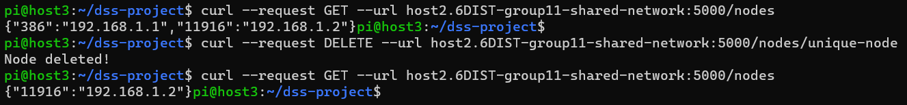
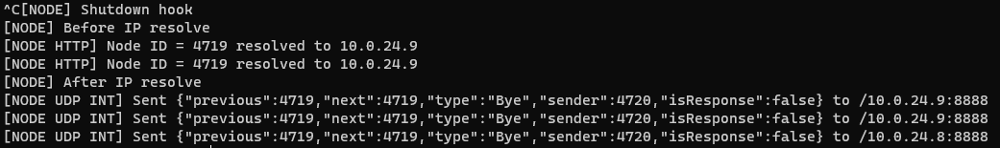
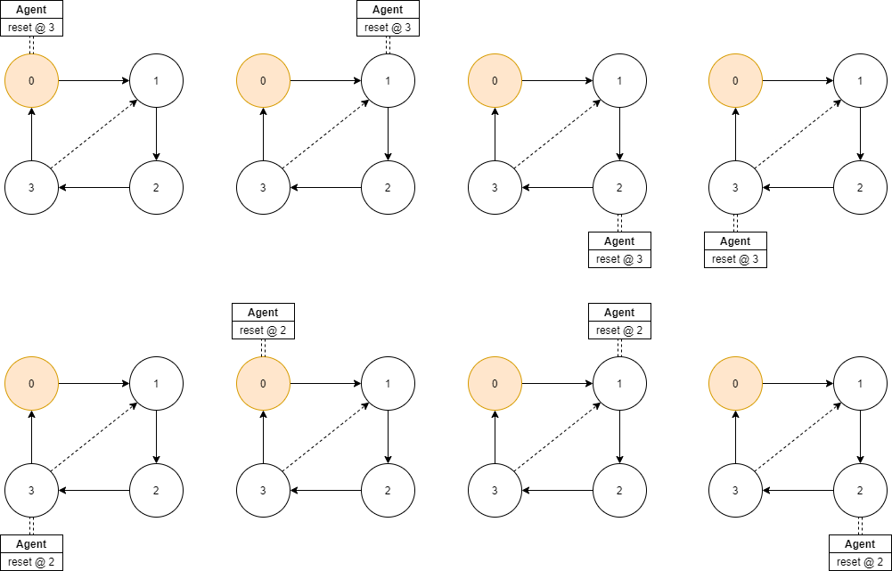
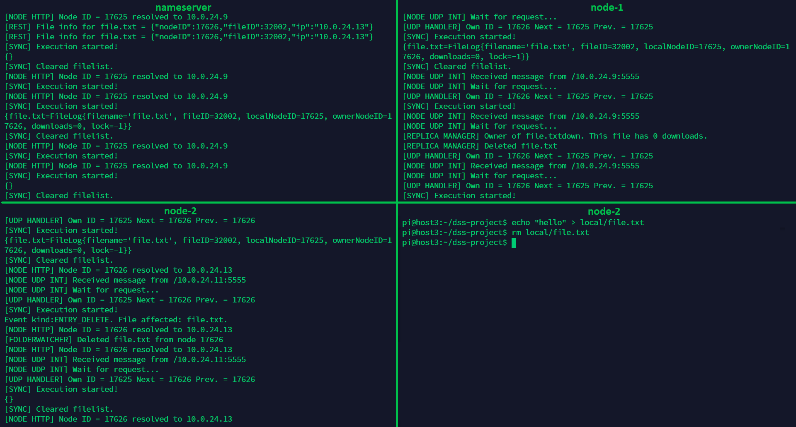
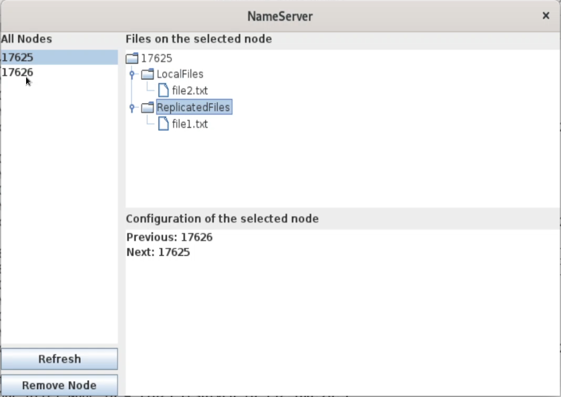

# Project distributed systems

**Group members: ** Justin Lauwerens, Ward Goossens and Willem Van der Elst
**Group name: ** NotAuthorized

[TOC]

## Introduction

This project was our first experience with creating a distributed system. It proved to be difficult in ways we didn't expect. First, keeping a large project like this organized is hard. Multiple people working on it at the same time doesn't help. Clean code is necessary to make everything comprehensible for all group members. Second, having multiple independent entities (multiple nodes, a naming server, agents, ...) makes debugging cumbersome. We tried to put as many useful print statements in the code to help us with this. 

All requirements were implemented and everything works as intended. Working outside the planned lab hours was crucial to achieve this. 

We gained a lot of experience in working together and learned that having a robust plan is essential before starting on a project like this. 

## Nameserver

In these two sessions, lasting a total of 6 hours, we built the first part of our project. The namingserver is a special node in the distributed filesystem. It does not store files, but resolves nodenames and filenames to IP addresses. We worked as group on this part by implementing different parts of the naming server. I developed the REST API of the naming server. Willem worked on the custom map to store the nodes and their IP addresses. Justin implemented the algorithm to resolve filenames to a certain node and IP address.

### Custom map

The nameserver needs a database to store couples of IDs and IP addresses. Export and import functionality of this map was required. To do this, the standard Java HashMap was extended with 2 new methods: exportMap() and importMap(). The export method uses a filestream to write the HashMap object to a file. After importing this HashMap object, its keys and values are extracted and put into the custom HashMap. 

A hashing function was needed to create a hash value from the name of a node. Java String hashCode() uses a range that is too large for our application. We need a range from $0$ to $2^{15} = (32768)$. We achieved this by taking the modulo of the absolute value of the hashCode result. The method is static because it is independent of any field and should be accessible to other classes without creating a new instance of a class.

```java
public static int hashingFunction(String name) { return abs(name.hashCode()) % 32768; }
```

### File lookup

Resolving a filename to a node is quite easy. We first hash our filename with the same hashing function that we used to get our node ID. Then we loop over our node IDs and keep the biggest one that is smaller than our file ID. If there isn’t a node ID that is smaller than our file ID, we need the highest ID of all nodes. This is done by initializing our wanted note ID to a negative number, as our hashing function's lowest possible value is 0. This way if no node ID was smaller than our file ID, it will be negative at the end of the loop. We now know it must go to the highest node. The easy solution would be to use the last entry of the HashMap, but sadly it isn’t sorted. So, we did this by also keeping track of it in the loop. Now we have the node’s ID, so we just look it up in the map. Lastly, we return a class containing the file ID, node ID ,and the node’s IP address.

### REST API

The nameserver uses the Spark web framework to implement the REST API. It implements the following routes:

- POST @ ‘/nodes’ to create a new node with parameters ‘name’ and ‘ip’.

- GET @ ‘/nodes’ to return a list of all registered nodes.

- GET @ ‘/nodes/:name’ to return the ID of a node.

- DELETE @ ‘/nodes/:name’ to remove a node.

- PUT @ ‘/nodes/:name’ to update the IP of a node with parameter ‘ip’.

- GET @ ‘/files/:filename’ to return the node ID, file ID and IP of a file.

The NameServer class stores the nodes in a HashMap in (ID, IP) key-value pairs. To calculate the ID of a node, the hash function mentioned before is used. The file lookup algorithm is implemented in the FileLookup class and used in the nameserver to handle the file requests.

### Using the nodes

The first problem we ran into was our Java version. We started with JDK 16 but installing this version on the nodes is not straightforward. Because of this issue, we set the version to 1.8. Next, we tried to build a .jar file on our local machine to execute on the nodes. We had a lot of trouble with this, but eventually, everything worked. We created the jar file according to the IntelliJ documentation.

By pushing the jar file to GitHub and pulling it back to the nodes, we got access to this file on the nodes.


### Tests

We started our nameserver on host2 and connected to it from host2 with curl commands.

In this screenshot, three new nodes are added to the nameserver. The third node has a name that is already used. The nameserver detects this and denies the POST request.


Below, we requested the IP address of the node for two filenames. In the first case, with filename `filename`, the file ID is 11769. The nodes have ID1=386 and ID2=11916, so the ID and IP of the first node are returned. For filename `a`, the file ID is 97 which is smaller than the smallest node ID. In this case, the nameserver returns the ID and IP of the node with the largest ID.


At last, we tested removing a node from the nameserver. Before removing the node, we requested a list of all registered nodes. After removing the node, we did the same to confirm that the node was deleted.



## System topology
In these two sessions, lasting a total of 6 hours, we implemented the discovery, shutdown, and failure services of the distributed file system. These services require unicast and multicast messages between nodes and are necessary to keep the ring structure in our distributed file system. To achieve this, we wrote different classes to handle UDP and HTTP communication.

### UDP

#### UDPInterface

This class handles incoming UDP packages and sends the requests to the RequesHandler. It also implements methods to send a multicast or unicast message to another node. The unicast method uses the HTTPRequestor to resolve a node ID to an IP address.

#### RequestHandler

A RequestHandler class implements the Runnable interface so it can process an incoming (UDP) request in a separate thread. The UDPInterface class waits for UDP packages in an infinite loop and creates a new thread for each incoming request (also with the Runnable interface).

The UDPInterface and RequestHandler classes are written two times, one time for the nameserver and one time for the node. This is because the nameserver and the nodes handle messages differently.

#### Messages

All our UDP messages are in a fixed JSON format. This format is defined by several classes in the messages package. Before sending a message, an object of the correct message type is created with the information as parameters. Then, the object is transformed to JSON with the Google gson library. The receiver decodes the JSON with the common Message class as a format to get the message type. Using the type, the JSON can be decoded to an object of the specific type.

### HTTP

The HTTPRequestor class implements some methods to request data from the nameserver through REST. At the moment, we only use the REST interface of the nameserver to resolve node ID’s into an IP address. In the future, it will also implement methods to do the file sharing. To send the HTTP requests, we use java.net.http. For this package, Java 11 is required so we had to upgrade the Java version on our nodes.

### Tests

#### Discovery & Bootstrap


This screenshot shows the log of the nameserver. The nameserver receives a Hello message from the nodes which enter the network. It adds these nodes to the local map and sends a response with the number of nodes in the network.


Node 1 entered the network first and sent a Hello message to the nameserver. It got a response from the nameserver stating that the amount of nodes in the network is one at the moment. Because of this, the node will set its previous and next ID to its own ID. Because the Hello message is multicast, the node receives its own message. We filter this out, so a node does not handle its own messages. Later, node 2 enters the network and node 1 receives its Hello message. Node 1 responds to this with a message InsertAfterAndBefore to let node 2 know what IDs to use as previous and next. Node 1 will also update his own previous and next IDs.


The last screenshot shows the log of node 2, who entered the network last. This log corresponds to the earlier logs.

#### Failure

We implemented a feature to call the failure method manually to test this method. The screenshots below show the mechanism working. Node 1 sent a message to notify the nameserver of the failure of node 2. The nameserver receives this message and removes the node from its map. It responds with a FailInfo message to get some information to the sender. The sender can use this to fix the circle topology.


#### Shutdown

We implemented a shutdown hook so the shutdown method gets called when Ctrl+C is used to terminate the node. Before shutting down, the node sends the same message to its neighbours and the nameserver. The neighbours use this to fix the circle topology, the nameserver deletes the node from the map.




## File replication

These two sessions were used to implement the last essential function of the distributed system: replication. Replication is necessary to improve the availability of files in the system under the uncertainty of node availability. The replication should be considered at three moments in time:

1. When a node enters the system
   - All local files on the new node should be replicated to an existing node.
   - Replications should be transferred to the new node if necessary
2. When a change occurs in the folder of local files
   - New files should be replicated to another node.
   - Modifications should trigger synchronization with the replica.
   - Replications must be deleted when the local file is deleted.
3. When a node shuts down
   - The replicas of local files should be deleted or the replication owner should be notified of the shutdown to prevent broken links to the local file.
   - The replicas on the node should be transferred.

The node which stores the replication of a file is chosen based on the hash of the filename and the hash of the node name. This decision was already implemented in the nameserver in one of the first sessions. An exception to this rule was added to ensure that a file is always served by two nodes. When the owner of the replica should be the owner of the local file, the previous node in the circle becomes the owner of the replica.

### TCP

Transferring the files between nodes is done using the TCP protocol. This is the third communication method that is implemented in the system. For messages to the nameserver we already implemented communication over REST (which is also TCP at a lower level). For group communications and direct messages between the nodes, we use UDP. We implemented the TCP communication similarly as the UDP interface.

The **TCPInterface class** handles incoming TCP requests and creates a new thread for each incoming request. The thread is a FileReceiver class that handles further receiving of the file. The TCP Interface also implements sending files. This is not done is a separate thread, but in the same thread as the caller of the sending method. The FileReceiver class parses the incoming request and stores the received file on the node. The replicas are stored in `/replicated`.

Each file is sent along with its log. This log contains the filename and its hash, the node ID of the node that has the local copy, and the number of times that the file has been downloaded. The log is created by the node that replicates its local file for the first time. When a replica is transferred or the local copy owner is terminated, this log is updated.

### FolderWatcher

The **FolderWatcher** class handles the replication and deletion of local files on the node. This class implements a separate thread that starts by replicating all the files in the local folder on the node. When finished, an infinite loop that watches the folder for changes is started. When a file is created, modified, or deleted, the state is synchronized to the replica owner using the TCP interface.

When the node shuts down, this thread notifies the owners of the replicas that this node is shutting down. The replica owners can delete the replica or break the link to the local file.

### ReplicaManager

The **ReplicaManager** is a class that does not use thread. It contains a list of all the replicas on the node by storing the file logs in a hash map. This class manages the creation and deletion of the replicas and works together with the TCP interface to implement this functionality. 

When a new node enters the system after this node, the replica manager checks if any of the replicas should be transferred to the new node. Every time a Hello message is received and the new node is inserted after this node, a method of the replica manager is called to handle this. This way, we can keep the location of all the replicas correct.

When the node shuts down, a method is called to transfer the replicas to another node. It defines the new owner of each replica and sends the files to their new owner.

### Tests

To test the system, we used Docker to simulate the cloud nodes. This allowed us to automate a part of the testing and setting up of the nodes. We wrote a script to build a new image and start a new container, each in a separate window so we could check the logs of all nodes simultaneously. When we got all the bugs out of the code, we pulled the code on the cloud nodes to do the final testing. In theory, this should not produce different results.

#### Discovery & Bootstrap


We started the nameserver first, and then the three nodes one-by-one. Each node already had a file in the local folder named `before-x.txt`. This file was there to test the replication at startup. When the first node entered the system, no other nodes are there to receive the replica of the local file. To ease the replication process, the local file is replicated to the same node. This has no use, but enables the transfer to a new node when possible.


When the second node enters the system, the replication of `before-1.txt` is transferred to node 2 and node 2 sends `before-2.txt`to node 1. According to the hash of the filenames, both files belong on node 1, but the exception on the rule makes sure that node 1 does not store its own replicas when possible.

#### New file


When we add a file to the local folder of node 1, the file is replicated to its previous node (node 2). The new file replica should also be on node 1, but the exception states that the replica must be on the previous node of node 1.

### Delete file


When we delete the local copy of the file on node 1, node 2 is notified and the replica is also deleted. The screenshot below verifies that the replica was in fact deleted from node 2.

#### Shutdown


At last, we tested the shutdown of a node. The screenshot shows that when we terminate node 2 (left), all replica owners are notified of the shutdown and all replicas are transferred to the previous node. The replica owner of `before-2.txt` (node 1) deletes the file because the file was never downloaded by another node. The replicas of `new1.txt`and `before-1.txt` are transferred to node 3 (right) because that is the previous node of node 2. When all transfers are finished, the ring topology of the system is restructured.

## Agents

Agents enable synchronization across the complete system. Because we had already implemented some synchronization functionality in other ways, we did not follow the exact specifications for the agent. This chapter describes how the required functionality is implemented, existing and new.

### Sync agent

The sync agent should make sure that the files in the system are all on the right node. This was something we already implemented by making each node check if a replica needs to be moved when a new node enters the system. A node knows about a new node in the system by listening for the Hello messages.

Additionally, the sync agent should maintain a list of all the files in the system and provide a locking mechanism for these files. Writing an agent for this was a bit of a challenge and required some refactoring of the code. At first, the nameserver and node were two different classes. Because the agent needs to work on the nameserver and the nodes, we refactored the code to make the nameserver and the node an implementation of a Device interface. We also restructured some other classes to make this change work.

The agent itself is a class that implements the Runnable and Serializable interface. The agent is initialized on the nameserver and started as a thread. The last task of the agent is to serialize itself and send it to the next node using our existing UDP communication scheme. When a node receives a message with the agent, the agent is deserialized and started as a thread.

The agent goes from node to node (including the nameserver) and is executed on each device. On each node, the list of replicas on that node is added to the file list on the agent and the locks owned by the node are updated on the agent file list. Each lock is an integer that contains -1 when it is not locked, but contains the ID of the lock owner when locked. 

To be able to keep the list complete but not permanent, we clear the list when one round is completed. The node that performs the reset of the agent is always the previous node of the node that performed the last reset. The diagram below shows two rounds of the agent. The orange circle is the nameserver and always has ID zero in the system. Nodes 1 and 3 are connected through a dashed line because the real circular topology does not include the nameserver.



The nameserver also runs a watcher to check if the agent was not lost because of a node failure. When no agent has been received for 30 seconds, it creates a new agent to restart the process.

The screenshot below shows a test of the sync agent. We tested this functionality on the nodes. A nameserver and two nodes were started and the sync agent started to circle between the three devices. When we added a file on the second node, the file lists on all the devices started to update and include the new file. When we deleted this file, all file lists became empty again. This shows that the file lists are updated correctly by the sync agent.



### Failure agent

We implemented the failure agent by running a thread on each node that pings its neighbors at a regular interval. When a neighbor does not respond anymore, the nameserver is notified of this failure. The nameserver then provides the required information to reconfigure the topology.

## GUI

The GUI provides an easy way to get an overview of the network. All node IDs are shown in a list and each one can be selected to get more information about it. The local and replicated files are shown in a tree. The previous and next nodes are listed under configuration. 

Removing nodes from the system can now be done with a simple click of a button. 



Our GUI is functional and not just some facade. To test it, we set up VMs because the nodes only have a CLI. A full demo video for the GUI can be found [at this link.](https://youtu.be/ndCB4L7awDM) The video shows the system and GUI working for a single node and two nodes. Nodes and files are added in the video to show that the GUI works. At last, both nodes are shut down through the GUI.

